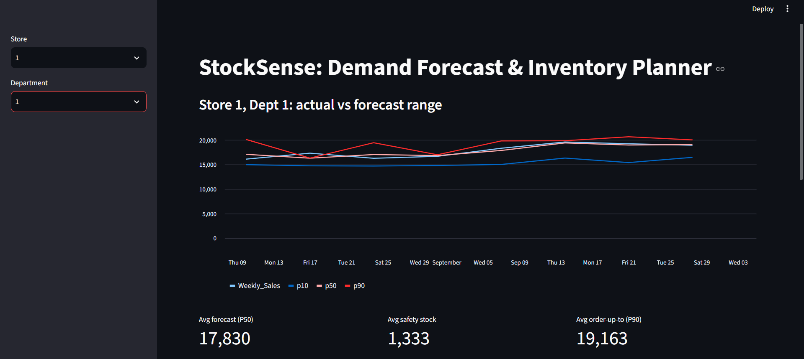
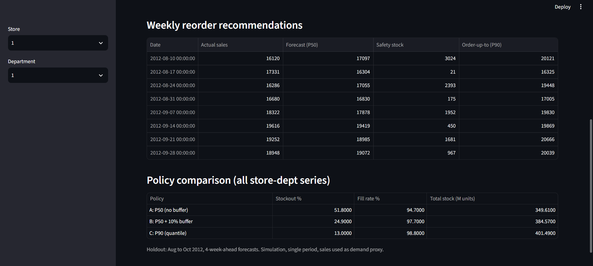

# StockSense: Demand Forecasting & Inventory Optimization

4-week-ahead demand forecasts with uncertainty ranges for Walmart store-department sales, turned into inventory (safety stock) decisions and compared across ordering policies. Includes a Streamlit dashboard.





## Problem

Retail teams must decide how much stock to hold weeks before demand is known. A single-number forecast hides risk. This project forecasts a range (P10 / P50 / P90) and uses it to set stock levels.

## Data

- Walmart store sales dataset (Kaggle): weekly sales by Store and Department, with holiday flag, store type and size.
- File used: 282,451 rows, 45 stores, 81 departments, 143 weeks (2010-02-05 to 2012-10-26).
- Many series have gaps. I kept the 2,385 store-department series with 90+ weeks and built a full weekly calendar. About 32% of weeks are missing and left as NaN (no fake fill).

## Approach

1. **EDA** (`eda.py`, `gaps.py`): trends, holiday effect, store types, missing weeks.
2. **Panel prep** (`prep.py`): filter series, full weekly calendar, holiday and store features.
3. **Forecast** (`model.py`): LightGBM, 4 weeks ahead, with lag (4, 8, 13, 52), rolling mean (4, 13), week, month, holiday, store type and size features. Time-based split: last 13 weeks (from 2012-08-03) as test.
4. **Uncertainty** (`uncertainty.py`): LightGBM quantile models for P10, P50, P90.
5. **Inventory simulation** (`inventory.py`): safety stock = P90 - P50, order-up-to level = P90, compared with simpler policies.
6. **Dashboard** (`app.py`): Streamlit app with forecast range chart, reorder table and policy comparison.

## Results (holdout: Aug to Oct 2012)

**Forecast accuracy (WAPE, lower is better)**

| Comparison | Baseline | LightGBM |
|---|---|---|
| vs Naive (sales 4 weeks ago) | 12.8% | 8.8% |
| vs Seasonal naive (same week last year) | 10.6% | 8.6% |

**Inventory policies**

| Policy | Stockout % | Fill rate % | Total stock (M units) |
|---|---|---|---|
| A: P50 only | 51.8 | 94.7 | 349.6 |
| B: P50 + 10% buffer | 24.9 | 97.7 | 384.6 |
| C: P90 (quantile) | 13.0 | 98.8 | 401.5 |

Policy C cut stockouts from 24.9% to 13.0% versus the flat 10% buffer, at about 4.4% more inventory. It is a trade-off: more stock also means more excess units.

## Limitations

- Simulation only: single period, no inventory carry-over.
- Sales are used as a proxy for demand, so true demand in stockout weeks is understated.
- The P10 to P90 range covered 76% of actuals (target 80%).
- Test window is only Aug to Oct 2012 and does not include the Nov/Dec peak. One split, no hyperparameter tuning.
- MarkDown (promotion) columns are not used yet.

## Run it

1. Python 3.13, then create and activate a virtual environment.
2. Install packages:

```bash
pip install pandas numpy matplotlib seaborn statsmodels lightgbm scikit-learn streamlit
```

3. Download the dataset from Kaggle and save it as `data/train.csv` (data is not in this repo).
4. Run in order:

```bash
python eda.py
python prep.py
python model.py
python uncertainty.py
python inventory.py
streamlit run app.py
```

## Next

Add a Claude-powered analyst agent that answers questions like "which items have the highest stockout risk next month?" using the forecast data.
